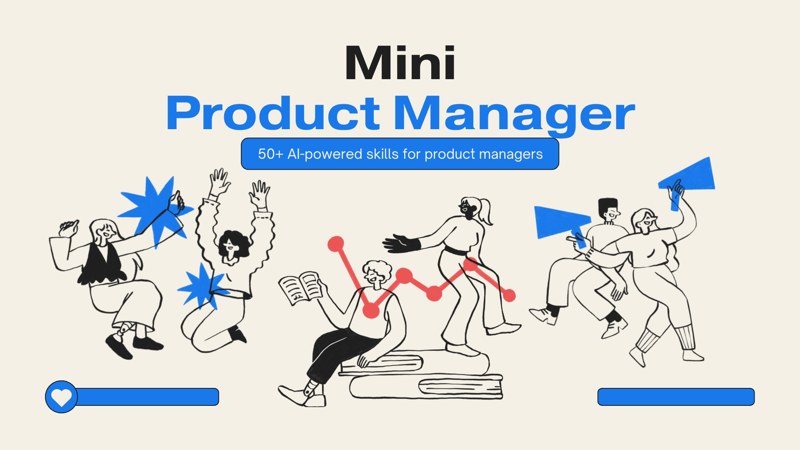

# Mini PM

**50 AI-powered skills for product managers, built as a Claude plugin.**



Stop writing the same PRDs, stakeholder updates, and prioritization frameworks from scratch. Mini PM gives you a full PM toolkit inside Claude — strategy, research, metrics, AI product design, and career prep, all invokable in one line.

---

## What's inside

| Category | Skills | Examples |
|---|---|---|
| Strategy & Vision | 10 | PRD, OKRs, PR/FAQ, GTM, Competitive analysis |
| User Research | 8 | Interview guides, Personas, JTBD, Journey maps |
| Prioritization | 8 | RICE, Kano, MoSCoW, Roadmap, Sprint planning |
| Metrics & Analytics | 7 | A/B test design, Funnel analysis, Cohort, KPI dashboard |
| Stakeholder & Comms | 7 | Exec briefs, Launch plans, Decision docs, Release notes |
| AI/ML Product | 5 | AI feature spec, Eval framework, RAG design, Guardrails |
| Career & Interview | 5 | STAR stories, Interview prep, Resume tailoring, Portfolio |

3 skills run on a **scheduler** (weekly strategy review, daily metrics check, Friday status update).  
1 skill runs as a **loop** (continuous competitor monitoring).

---

## Install

### Via Cowork marketplace
Search **Mini PM** in the Cowork plugin marketplace and click Install.

### Manual install (Claude Code CLI)
```bash
git clone https://github.com/your-name/mini-pm.git
cp -r mini-pm/skills/ ~/.claude/commands/
```

---

## Usage

Once installed, invoke any skill by name:

```
/prd  Real-time collaboration feature for enterprise design teams
```
```
/rice  [paste your feature backlog]
```
```
/north-star  B2B SaaS project management tool, growth stage
```
```
/exec-brief  We need budget approval to rebuild the onboarding flow
```
```
/star-story  I launched Bedrock Agents at AWS, drove 3x adoption — stakeholder management angle
```

Every skill accepts free-text input and returns structured, senior-quality output.

---

## All 50 skills

### Strategy & Vision

| Skill | What it produces |
|---|---|
| `/prd` | Full PRD — problem, personas, requirements, metrics, launch plan |
| `/vision` | Vision statement, pillars, anti-visions, and tests of a good vision |
| `/north-star` | North Star metric with metric tree and counter-metrics |
| `/okr` | OKRs with key results, scoring rubric, and cross-team dependencies |
| `/competitive` | Competitive landscape, feature matrix, white space, strategic implications |
| `/market-size` | TAM/SAM/SOM with top-down and bottom-up approaches, triangulated |
| `/positioning` | Positioning statement, value pillars, message-audience matrix |
| `/pr-faq` | Amazon-style press release and internal/external FAQ |
| `/gtm` | GTM strategy with launch tiers, channel plan, and success criteria |
| `/strategy-review` | Weekly strategy review template — sets up a Monday morning scheduler |

### User Research & Discovery

| Skill | What it produces |
|---|---|
| `/user-interview` | Interview guide with hypothesis-driven questions and synthesis template |
| `/persona` | 2–3 rich user personas with JTBD, journey, and red flags |
| `/jtbd` | Full JTBD analysis — job map, outcome statements, opportunity scores |
| `/empathy-map` | Empathy map across Think/Feel/See/Hear/Say/Do + design principles |
| `/user-journey` | End-to-end journey map with emotional arc and opportunity hotspots |
| `/survey` | Survey design with sample size calc, question types, and analysis plan |
| `/research-synthesis` | Turns raw research into ranked insights with hypothesis scorecard |
| `/pain-points` | Pain inventory, root-cause clustering, severity matrix, fix roadmap |

### Prioritization & Roadmap

| Skill | What it produces |
|---|---|
| `/rice` | RICE scoring table with sensitivity analysis and strategic overlay |
| `/roadmap` | Theme-based roadmap with Now/Next/Later, trade-offs, and capacity check |
| `/moscow` | MoSCoW classification with challenge round and cut communication plan |
| `/kano` | Kano model classification with investment allocation recommendation |
| `/backlog` | Backlog health check, 90-min grooming agenda, story refinement template |
| `/sprint` | Sprint goal, capacity plan, story selection, risk register, DoD |
| `/opportunity-score` | Ulwick ODI opportunity scoring — finds the most underserved outcomes |
| `/dependency-map` | Dependency graph, critical path, cross-team alignment tracker |

### Metrics & Analytics

| Skill | What it produces |
|---|---|
| `/metrics` | Metrics hierarchy (L1/L2/L3), HEART framework, funnel, alerting thresholds |
| `/ab-test` | A/B test design with power analysis, assignment rules, and decision framework |
| `/funnel` | Funnel performance table, drop-off analysis, optimization scorecard |
| `/kpi` | Dashboard architecture (exec/PM/feature layers), metric definitions, rituals |
| `/cohort` | Cohort retention table, benchmarks by product type, magic moment analysis |
| `/anomaly` | Structured anomaly investigation — is it real? root cause tree, post-mortem |
| `/metrics-monitor` | Daily threshold checks — sets up a weekday 8 AM automated metrics alert |

### Stakeholder & Communications

| Skill | What it produces |
|---|---|
| `/exec-brief` | One-page executive briefing with TL;DR, options table, and clear ask |
| `/stakeholder-map` | Power-interest grid, influence network, RACI, communication plan |
| `/launch-plan` | Launch readiness checklist, progressive rollout, war room, rollback plan |
| `/status-update` | Weekly status template — sets up a Friday 4 PM automated draft |
| `/meeting-agenda` | Decision-driven agenda with pre-read, ground rules, and follow-up template |
| `/decision-doc` | Decision doc with options, rationale, trade-offs, and dissent log |
| `/release-notes` | Customer-centric release notes with social summary and tone adaptation |

### AI/ML Product

| Skill | What it produces |
|---|---|
| `/ai-spec` | AI feature spec — behavior, edge cases, safety, trust design, eval plan |
| `/eval-framework` | Eval dimensions, test set design, scoring rubrics, regression gate |
| `/rag-design` | RAG system spec — chunking, retrieval strategy, quality metrics, cost model |
| `/guardrails` | Content policy, hardcoded/softcoded rules, refusal design, red team plan |
| `/ai-use-case` | AI opportunity discovery — automate/augment/analyze/accelerate framework |

### Career & Interview Prep

| Skill | What it produces |
|---|---|
| `/star-story` | Polished STAR story with 30-sec teaser, failure variant, probe prep |
| `/interview-prep` | Company research brief, question bank, case framework, questions to ask |
| `/resume-tailor` | Gap analysis, bullet rewrites, ATS keyword integration, cuts to make |
| `/portfolio` | Portfolio case study — context, insight, decisions, results, reflection |
| `/competitor-watch` | Competitor intelligence report — sets up a weekly monitoring loop |

---

## Scheduled & loop skills

| Skill | Type | When it runs | What it does |
|---|---|---|---|
| `/strategy-review` | Scheduler | Every Monday 9 AM | Generates filled weekly strategy review |
| `/metrics-monitor` | Scheduler | Weekdays 8 AM | Checks metrics vs. thresholds, flags anomalies |
| `/status-update` | Scheduler | Every Friday 4 PM | Drafts weekly stakeholder status update |
| `/competitor-watch` | Loop | Weekly | Scans for competitor moves, generates intelligence report |

---

## Repo structure

```
mini-pm/
├── .claude-plugin/
│   └── plugin.json        ← plugin manifest
├── skills/
│   ├── prd/
│   │   └── SKILL.md
│   ├── rice/
│   │   └── SKILL.md
│   └── ...                ← 50 skill folders
├── commands/              ← Claude Code CLI format (same skills)
└── README.md
```

---

## License

MIT — free to use, fork, and extend.
